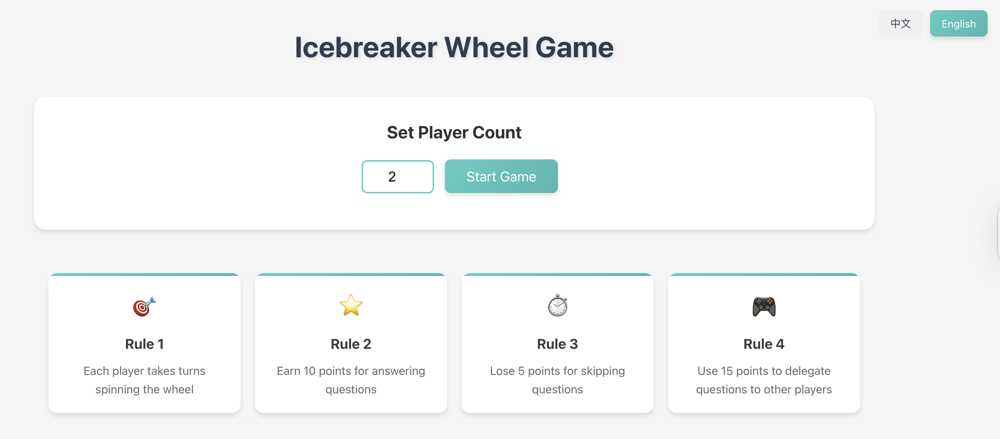

# 🎉 Icebreaker Wheel Game

An interactive, turn-based icebreaker game that helps groups of people get to know each other through fun, randomized questions! Built with React and deployed on GitHub Pages.

🌐 **Live Demo**: [Play it here!](https://elizaeee.github.io/Ice-breaking-game/)

---

## 🚀 Features

- 🎡 Spin the wheel to randomly pick a player
- 🗣️ Players answer fun icebreaker questions
- 💬 Earn or lose points based on your responses
- 🎮 Use points to delegate questions to others
- 🌍 Switch between languages (English / 中文)
- 👥 Player count is customizable before each round

---

## 🕹️ Rules of the Game

| Rule | Description |
|------|-------------|
| 🎯 **Rule 1** | Each player takes turns spinning the wheel |
| ⭐ **Rule 2** | Earn 10 points for answering questions |
| ⏱️ **Rule 3** | Lose 5 points for skipping questions |
| 🎮 **Rule 4** | Use 15 points to delegate questions to other players |

---

## 📸 Preview



---

## 🛠 Tech Stack

- [React](https://reactjs.org/)
- [TypeScript](https://www.typescriptlang.org/)
- [Vite](https://vitejs.dev/)
- [Framer Motion](https://www.framer.com/motion/) for animations
- [GitHub Pages](https://pages.github.com/) for deployment

---

## 📦 How to Run Locally

```bash
git clone https://github.com/elizaeee/Ice-breaking-game.git
cd Ice-breaking-game
npm install
npm run dev


Copyright © 2025 Eliza Chen

All rights reserved. This project and its source code may not be copied, modified, or distributed without explicit permission.
